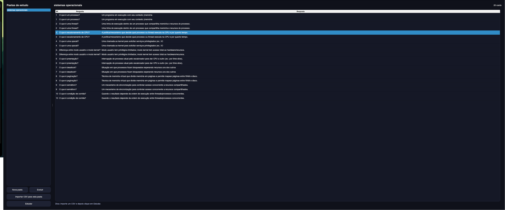
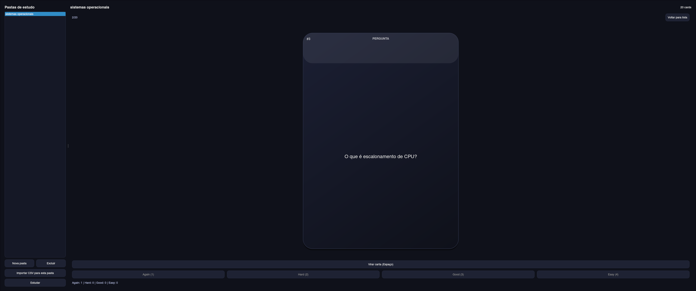

# Flashcards Desktop

Aplicativo desktop **offline** para estudos com **flashcards**, organizado por **pastas/decks** e com **importação via CSV**.  
O modo de estudo exibe uma **carta estilo baralho** com **animação de virada** (pergunta/ resposta) para reforçar recuperação ativa.

---

## Funcionalidades

- **Pastas/Decks de estudo** (ex.: Sistemas Operacionais, Banco de Dados, etc.)
- **Importação de flashcards via CSV padronizado**
- **Lista de cards** por pasta (visualização rápida)
- **Modo estudo** com:
  - carta visual (rounded corners, sombra, layout tipo card de baralho)
  - **animação de flip** para revelar a resposta
  - avaliação **Again / Hard / Good / Easy**
  - atalhos: **Espaço** (virar) e **1/2/3/4** (avaliar)

---

## Tecnologias

- **Python 3**
- **PySide6 (Qt)** para interface desktop
- **SQLite** para persistência local (offline)

---

## Prints

> Imagens dentro de `assets/`

<p align="center">
  
</p>

<p align="center">
  
</p>

---

## Formato do CSV

O importador espera um CSV com os cabeçalhos:

- `numero`
- `pergunta`
- `resposta`

Exemplo:

```csv
numero,pergunta,resposta
1,O que é um processo?,Um programa em execução com seu contexto (memória, registradores, recursos).
2,O que é uma syscall?,Uma chamada ao kernel para solicitar serviços privilegiados.
```

**Observação:** se um campo tiver vírgula, coloque entre aspas.

```csv
3,"O que é um scheduler?","Componente do SO que decide o que executa, quando executa e por quanto tempo."
```

---

## Como rodar (local)

### 1) Clonar e entrar na pasta

```bash
git clone <SEU_REPO.git>
cd flashcards-desktop
```

### 2) Criar e ativar o ambiente virtual

**Linux/macOS**
```bash
python -m venv .venv
source .venv/bin/activate
```

**Windows (PowerShell)**
```powershell
python -m venv .venv
.\.venv\Scripts\Activate.ps1
```

### 3) Instalar dependências

```bash
pip install -r requirements.txt
```

### 4) Rodar o app

```bash
python run.py
```

---

## Como usar

1. Clique em **Nova pasta** e crie um deck (ex.: *Sistemas Operacionais*).
2. Selecione a pasta criada.
3. Clique em **Importar CSV para esta pasta** e selecione um arquivo `.csv` (o app abre por padrão a pasta `data/` do projeto).
4. Clique em **Estudar**.
5. No modo estudo:
   - **Espaço**: virar a carta (pergunta ↔ resposta)
   - **1 / 2 / 3 / 4**: Again / Hard / Good / Easy (após revelar a resposta)

---

## Estrutura do projeto

```txt
flashcards-desktop/
├─ assets/
│  ├─ print-1.png
│  └─ print-2.png
├─ data/
│  └─ sistemas_operacionais.csv
├─ flashcards_app/
│  ├─ __init__.py
│  ├─ __main__.py
│  ├─ app.py
│  ├─ core/
│  │  ├─ __init__.py
│  │  ├─ csv_importer.py
│  │  ├─ db.py
│  │  ├─ logging_config.py
│  │  └─ models.py
│  ├─ repos/
│  │  ├─ __init__.py
│  │  ├─ card_repo.py
│  │  └─ deck_repo.py
│  ├─ services/
│  │  ├─ __init__.py
│  │  ├─ errors.py
│  │  └─ study_session.py
│  └─ ui/
│     ├─ __init__.py
│     ├─ flashcard_widget.py
│     ├─ main_window.py
│     └─ styles.py
├─ requirements.txt
└─ run.py
```

---

## Autor

**Miguel de Castilho Gengo**  
GitHub: **Gengo250**
